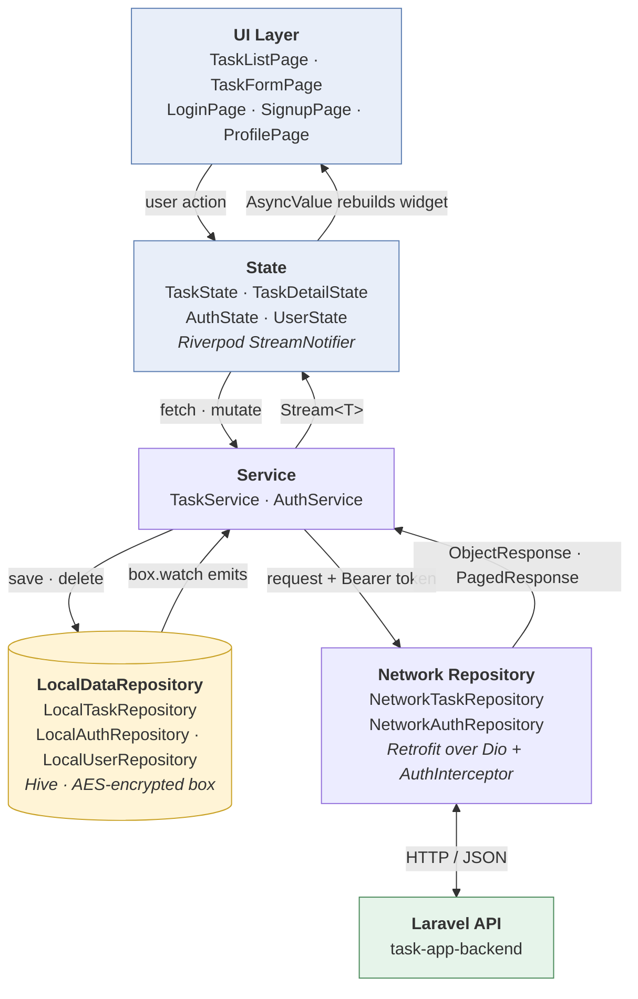
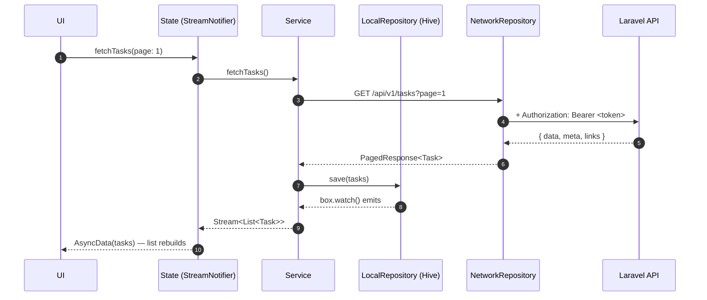

# Task App

A Flutter task manager backed by a Laravel API. Melos monorepo with two packages:

| Package | Contents |
|---|---|
| `packages/app` | The Flutter application — features, navigation, storage, networking |
| `packages/core` | Shared architecture — route providers, navigation middlewares, storage abstraction, response envelopes, exception adapter, `PaginatedListView` |

Platforms: **Android and iOS**.

---

## Prerequisites

| Tool | Version | Notes |
|---|---|---|
| [FVM](https://fvm.app/documentation/getting-started/installation) | latest | Pins Flutter per-project |
| Flutter | `3.41.9` | Pinned in `.fvmrc`; FVM installs it for you |
| [Melos](https://melos.invertase.dev/) | `^6.3.2` | `dart pub global activate melos` |
| PHP + Composer | PHP 8.2+ | For the backend |
| MySQL / SQLite | — | Backend database |

---

## 1. Backend

The API lives in a separate repository:

**https://github.com/Rakshak1344/task-app-backend**

```bash
git clone https://github.com/Rakshak1344/task-app-backend.git
cd task-app-backend

composer install
cp .env.example .env
php artisan key:generate
php artisan migrate

php artisan serve --host=0.0.0.0 --port=8000
```

`--host=0.0.0.0` matters. The default binds to `127.0.0.1`, which is unreachable from an Android emulator or a physical device — only from the host machine itself.

Endpoints the app consumes (all under the `/api/v1` prefix):

| Method | Path | Auth |
|---|---|---|
| `POST` | `/signup` | public |
| `POST` | `/login` | public |
| `GET` | `/me` | Bearer |
| `GET · POST · PUT · DELETE` | `/tasks[/{id}]` | Bearer |

Tasks are scoped to the authenticated user by `auth:sanctum` plus `TaskPolicy`, so a token only ever sees its owner's tasks.

---

## 2. App setup

```bash
git clone <this-repo>
cd task-app

# Install and pin Flutter 3.41.9 from .fvmrc
fvm use --force

# Resolve all packages and wire up the local path overrides
melos bootstrap

# Generate freezed / json_serializable / riverpod / retrofit code
melos run gen:build
```

`melos bootstrap` is required before anything else — `packages/app` depends on `core` through a Melos-generated `pubspec_overrides.yaml`, so a bare `flutter pub get` will not resolve.

Generated files (`*.g.dart`, `*.freezed.dart`) are **not committed**, so `melos run gen:build` is mandatory on a fresh clone. Nothing will compile until it has run.

---

## 3. Configuration

Runtime config comes from a dart-define file. **`*.defines.json` is gitignored**, so create it yourself:

`packages/app/dev.defines.json`

```json
{
  "BASE_URL": "http://10.0.2.2:8000/api/v1",
  "ENVIRONMENT": "dev"
}
```

Pick `BASE_URL` for your target:

| Target | `BASE_URL` |
|---|---|
| Android emulator | `http://10.0.2.2:8000/api/v1` |
| iOS simulator | `http://localhost:8000/api/v1` |
| Physical device | `http://<your-machine-LAN-IP>:8000/api/v1` |

Two things to get right here:

- **Use `http`, not `https`.** `php artisan serve` speaks plain HTTP. Pointing at `https://` fails the TLS handshake and surfaces as `DioException [unknown]: null`, which tells you nothing.
- **Cleartext HTTP is already permitted in debug builds only** — via `android/app/src/debug/res/xml/network_security_config.xml` and `NSAllowsLocalNetworking` in `ios/Runner/Info.plist`. Release builds keep the strict platform defaults, so a production deployment must be HTTPS.

The keys are read in `packages/app/lib/config/env.dart`. Its compiled-in defaults are developer-machine specific; always pass the defines file rather than relying on them.

---

## 4. Run

```bash
cd packages/app
fvm flutter run --dart-define-from-file=dev.defines.json
```

Build a release artifact the same way:

```bash
fvm flutter build apk    --dart-define-from-file=prod.defines.json
fvm flutter build ipa    --dart-define-from-file=prod.defines.json
```

Sign up in the app to create an account — the token is persisted, so subsequent launches go straight to the task list.

---

## 5. Common commands

```bash
melos run gen:build      # one-shot codegen
melos run gen:watch      # codegen in watch mode while developing
melos run analyze        # analyze every package
cd packages/app && fvm flutter test
```

---

## Architecture

Data flows in a single loop. The UI **never** consumes a network response directly — the service writes results into the local Hive store, and the UI reacts to that store's stream. One source of truth on screen, and the app stays readable offline.



### Why the loop matters

A write does not update the UI directly. It lands in Hive, and Hive's watcher pushes it back up:



The same loop drives authentication. `AuthService.login` writes the access token to Hive; `AuthState` watches that key, so the token appearing is what flips the app into its signed-in state and lets the router redirect. Logging out deletes the key and the loop runs in reverse.

### Layer responsibilities

| Layer | Responsibility |
|---|---|
| **UI** | Widgets only. Watches state, dispatches user intent. |
| **State** | Riverpod notifiers. Stream-backed ones (`TaskState`, `AuthState`) expose the local store; request-scoped ones (`LoginState`, `TaskFormState`) track a single in-flight operation. |
| **Service** | Orchestration. Calls the network, then persists the result locally. The only layer that knows about both sides. |
| **LocalDataRepository** | Hive-backed persistence behind the `Preferences` abstraction in `core`. Exposes `watch()` streams. |
| **NetworkRepository** | Retrofit clients over Dio. `AuthInterceptor` attaches the bearer token and clears it on a 401. |

---
